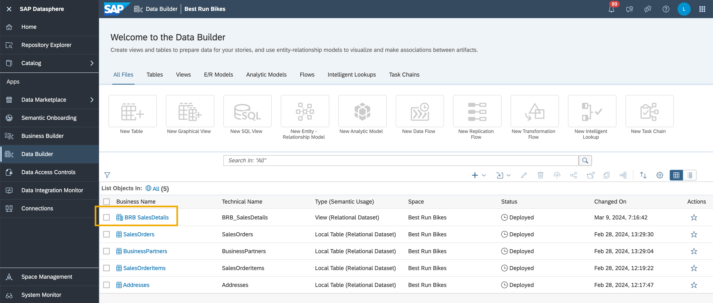
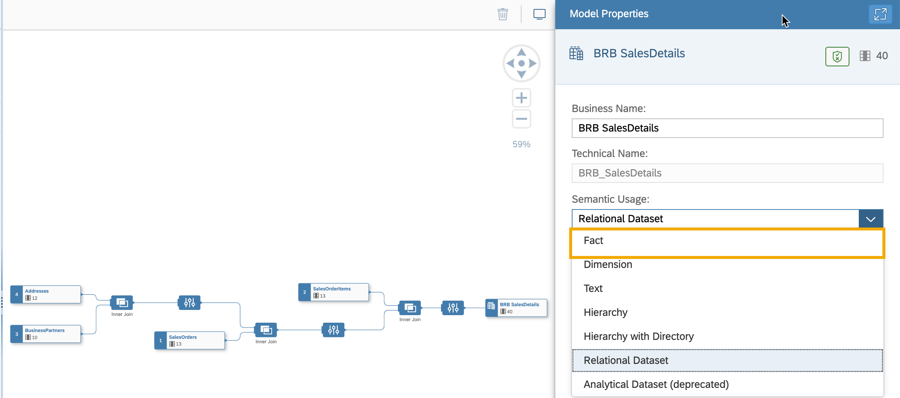
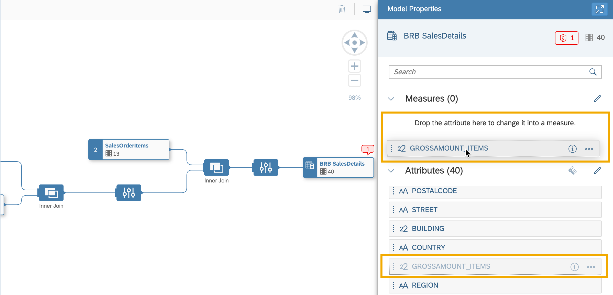
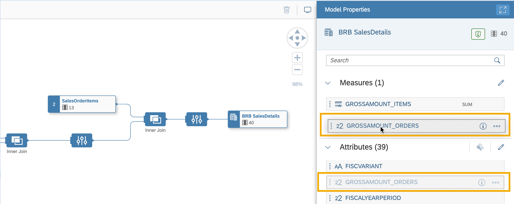
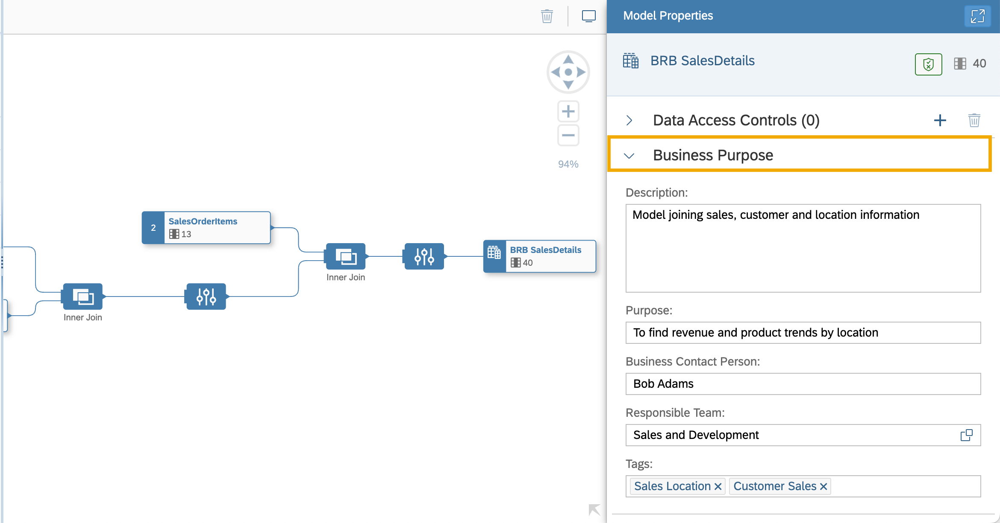
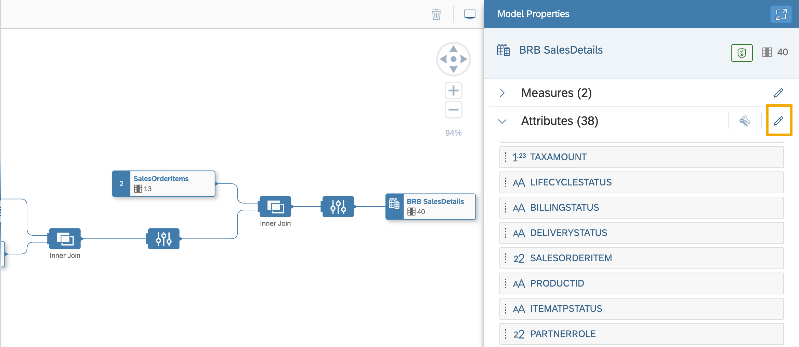
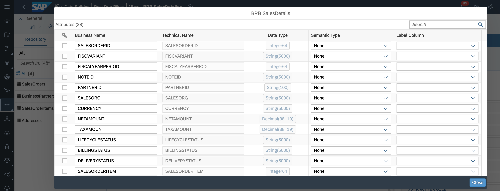
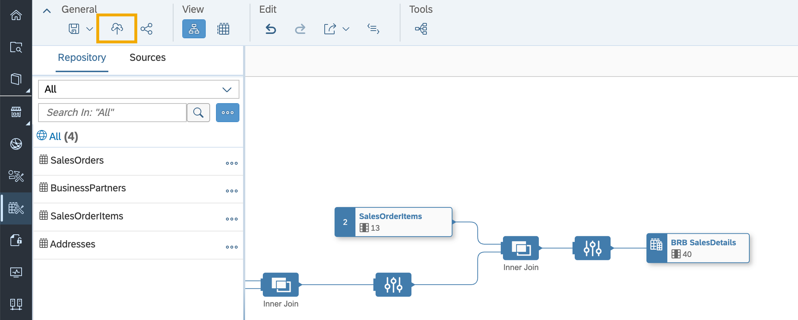
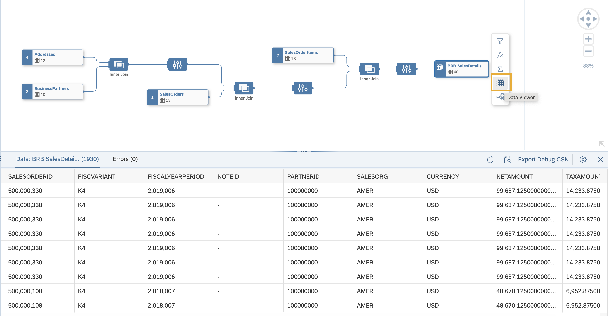

# Define Measures and Add Business Information to a View
<!-- description --> SAP Data Warehouse Cloud allows you to add business information to your data, making it easier for all users to make sense of the data. This is what we call the semantic layer. You can add business names to columns within tables, as well as semantic types to better identify the type of data in columns.

## Prerequisites
 - You have [graphically created your data model.](data-warehouse-cloud-7-graphicalview)

## You will learn
  - What semantic information is
  - How to define measures
  - How to add business information
  - How to change business names of measures and attributes
  - How to change the semantic type of measures and attributes
  - How to preview your modelled dataset

  This tutorial is part of a mission, in which you try to help Best Run Bikes to to get a holistic view of their sales data by using the power of SAP Data Warehouse Cloud. You will get the sales data of Best Run Bikes and it is your mission to use the features of SAP Data Warehouse Cloud to help the bike suppliers make the best possible business decisions.

  This mission consists of 8 modules that contain the necessary steps you need to follow in your mission to help Best Run Bikes:

  1. [Sign up for trial.](data-warehouse-cloud-1-begin-trial)
  2. [Get to know the SAP Data Warehouse Cloud interface](data-warehouse-cloud-2-interface)
  3. [Add users and assign roles](data-warehouse-cloud-3-add-users)
  4. [Create your Space](data-warehouse-cloud-4-spaces)
  5. [Import your datasets](data-warehouse-cloud-5-import-dataset)
  6. [Create an entity relationship model](data-warehouse-cloud-6-entityrelationship-model)
  7. [Create a graphical view model](data-warehouse-cloud-7-graphicalview)
  8. **You are here ->** [Define measures, business semantics and preview your data](data-warehouse-cloud-8-define-measures)

  You can also follow the steps in this tutorial by watching this video

  <iframe id="kmsembed-1_k1l2h463" width="421" height="300" src="https://video.sap.com/embed/secure/iframe/entryId/1_k1l2h463/uiConfId/30317401/pbc/122287171/st/0" class="kmsembed" allowfullscreen webkitallowfullscreen mozAllowFullScreen allow="autoplay *; fullscreen *; encrypted-media *" referrerPolicy="no-referrer-when-downgrade" sandbox="allow-downloads allow-forms allow-same-origin allow-scripts allow-top-navigation allow-pointer-lock allow-popups allow-modals allow-orientation-lock allow-popups-to-escape-sandbox allow-presentation allow-top-navigation-by-user-activation" frameborder="0" title="T08-Define Measures and Add Business Information to a View.mp4"></iframe>

---

### Understand semantic information

Semantic information is simply a layer of information that is focused on providing a "translation" in business language to help all users understand each aspect of the data. Sometimes datasets can be hard to read for users who are not familiar with the way the data is structured, using a lot of abbreviations or acronyms. The semantic layer of SAP Data Warehouse Cloud can help you solve that issue by adding new column names, as well as defining the appropriate semantic type information for each column.

The following is a list of the potential semantic usage that you can determine for your tables and views:

- **Relational Dataset** - [default] Contains columns with no specific analytical purpose.
- **Dimension** - Contains attributes with master data like a product list or store directory, and supporting hierarchies (see [Create a Dimension](https://help.sap.com/viewer/c8a54ee704e94e15926551293243fd1d/cloud/en-US/5aae0e95361a4a4c964e69c52eada87d.html)).
- **Analytical Dataset** - Contains one or more measures and attributes. This is the principal type of artefact used by analytical clients (see [Create an Analytical Dataset](https://help.sap.com/viewer/c8a54ee704e94e15926551293243fd1d/cloud/en-US/30089bd2aa754ab996a62cf5842ae60a.html)).
- **Text** - Contains attributes used to provide textual content in one or more languages (see [Create a Text Entity for Attribute Translation](https://help.sap.com/viewer/c8a54ee704e94e15926551293243fd1d/cloud/en-US/b25726df116b463e97435ba720e48ac9.html)).

Though tables and views can both be identified with semantic usage, only views have the property Expose for Consumption, which makes them available to SAP Analytics Cloud and other analytical clients.

To be consumable as a model in SAP Analytics Cloud, your entity must be a view with:
- Semantic Usage set to Analytical Dataset (see [Create an Analytical Dataset](https://help.sap.com/viewer/c8a54ee704e94e15926551293243fd1d/cloud/en-US/30089bd2aa754ab996a62cf5842ae60a.html)).
- Expose for Consumption enabled.
- At least one measure identified (see [Measures](https://help.sap.com/viewer/c8a54ee704e94e15926551293243fd1d/cloud/en-US/33f7f291538a44a293a89f6f1cf1fa81.html)).

### Define measures

Now it's time to define measures in your data. If you need more information on what measures are, please see [this help guide](https://help.sap.com/viewer/c8a54ee704e94e15926551293243fd1d/cloud/en-US/33f7f291538a44a293a89f6f1cf1fa81.html?q=measures).

1.	Go to the Data Builder. You may need to select your appropriate space first.
2.	Click on the graphical view that you created earlier.

    

3.	Change the semantic usage of this to **Analytical Dataset** in the Model Properties tab on the right-side of the screen. This will allow you to change attributes into measures.

    <!-- border -->

> It is necessary to define some of our columns as measures in order to create charts and graphs in SAP Analytics Cloud.

4.	To convert an attribute into a measure, simply drag and drop the attribute into the measures area in the Model Properties tab. In this example, define `GrossAmount_Items` as a measure.

    

5.	Define `GrossAmount_Orders` as a measure as well.

    

> The system will not allow you to define dimensions as measures.

### Add business information

Next, add some more business information about the data model.

1.	Open the Business Purpose panel under Attributes.
2.	Here, fill in the description and purpose of this model, as well as the business contact person, responsible team and relevant tags.

    <!-- border -->

### Change business names for measures and attributes

You can also change the business names of measures and attributes. This is particularly useful if some of your data columns have names that wouldn't be recognisable to your colleagues.

1.	To do this, click on the pencil icon next to **Attributes**.

    <!-- border -->

2.	This takes you to an interface that allows you to type new names alongside the technical names. This doesn't change the name of our column in the data itself, it just adds a business name in addition to it. You also have the option to add spaces or change column names to lowercase.

    

### Change the semantic type of measures and attributes

Another part of adjusting your semantic layer information is the opportunity to change the semantic type of your column. Semantic types identify that a column contains a value, a quantity, a date, geospatial or textual information, or another kind of semantic information.

For example, next to a column, open the drop-down list and find **Geolocation - Latitude**.

This tells the system specifically what kind of data is in the column, and is very useful when performing data analysis.

> To add semantic types, you must set the semantic usage of your view or table to Dimension or Analytical Dataset.

### Save and deploy

Once you are done adding your semantic information and types, don't forget to first save, and then deploy your view.

1.	Click on the save icon on the top left corner of the screen.

    

2.	Then, click on the deploy icon next to the save icon to deploy your model.

    

### Preview your Data

You have now successfully created, saved and deployed your analytical dataset.

If you wish, you can preview your data model by clicking on the data preview icon next to your output node.

<!-- border -->

The preview is limited to a maximum of 1,000 lines and, by default, to the first 20 columns in the table or view. You can also reorder, sort, or filter your columns according to your needs in the data preview section of the data builder.

Having successfully created a working data model, you can now help Best Run Bikes bring together information from different parts of their business to understand more about their sales. You can now use these data models to visualise your sales or transaction data, and subsequently draw insights and make better business decisions in your organisation.

Congratulations on finishing this mission and getting to know the basics of SAP Data Warehouse Cloud! To continue learning, please see the [other tutorials and missions available here](https://developers.sap.com/tutorial-navigator.html?tag=products:technology-platform/sap-data-warehouse-cloud).

---
