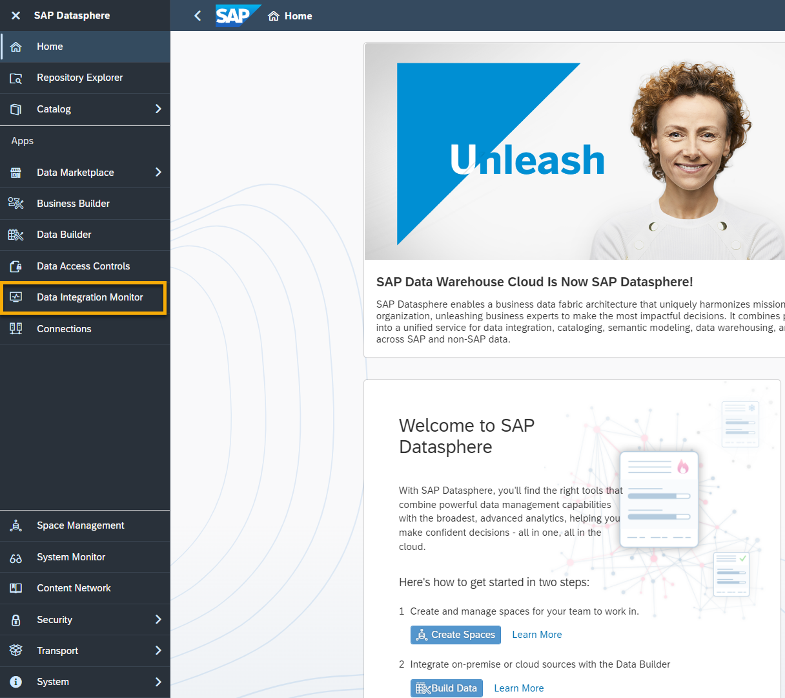

# Integrate and Monitor Data with SAP Datasphere
<!-- description --> Get started with Data Integration Monitor, which allows you to monitor the frequency and status of data loads for each table within a Space.

## You will learn
- How to access the Data Integration Monitor
- How to use the Data Integration Monitor dashboard
- The types of monitoring you can do with the Data Integration Monitor

## Intro
The Data Integration Monitor helps you to monitor and manage table replication from sources outside of SAP Datasphere, showing you the frequency of data refresh. It makes it easy to see how many tables you have, how much space they are using, and which actions were recently performed on them. It allows you also to replicate data, create persistent views, analyse remote connections, and get details of these actions.

> CSV files uploaded directly to SAP Datasphere are not monitored.

---

### Access the Data Integration Monitor 

1.	In SAP Datasphere, click on the **Data Integration** icon on the left- side menu.

    <!-- border -->

2.	Choose your Space and you see the **Remote Table Monitor** dashboard.

    <!-- border -->

Here you can see an overview of all remote tables that currently exist in this Space.

### Use the Data Integration Monitor dashboard

The Data Integration Monitor works like a dashboard, allowing you to drill down to details about the use of storage within a Space, particularly detailing how many tables are stored in the Space, and giving other details about these tables.

You will get an overview of the remote tables within the Space you have selected, as well as the following details about each table from the remote table monitor dashboard:

- Name
- Number of records within that table
- Connection name
- Amount of storage space each table is using
- Date of latest update
- Date of most recent load and refresh frequency
- Next run

You can change the way the list is sorted or filter it to find more easily the information you are looking for by clicking on the sort icon next to the table column. As an example, you can find the tables that are consuming more space by filtering the list.

  <!-- border -->

From this main list, you can drill down further by clicking on the drill down icon on the right of the dashboard. This can help you understand how often a table is loaded and what is the status of each time the table was loaded, that is, each time the data within this table was refreshed.

  <!-- border -->

You will also be able to go directly from here into the table editing feature of the Data Builder. Click on the open in editor option on the top right to do so.

### Types of monitoring you can do in the dashboard

These are the types of monitoring you can do with the Data Integration Monitor dashboard:

**Remote Table Monitor**

With this monitor, you can:
•	Copy data from remote tables that have been deployed in your Space.
•	Monitor the replication of the data.
•	Schedule a copy of the full set of data from the source.
•	Set up replication of data changes in real time via the **change data capturing** option.

**View Persistency Monitor**

The View Persistency Monitor is where you load new snapshot of the data and schedule persisted data views. You can turn your views into persistent views to improve performance while accessing your data.

**Data Flow Monitor**

The Data Flow Monitor is where you view and monitor the details of the executed data flows.

**Remote Query Monitor**

The Remote Query Monitor is where you check and analyse how the communication is running between the underlying database of SAP Datasphere, which is SAP HANA Cloud; SAP HANA database, and the connected remote source systems.

**Task Chain Monitor**

The Task Chain Monitor is where you monitor the status and progress of running and previously run task chains.

> **Well done!**
>
> You have completed the second tutorial of this group! Now you understand the how to access the Data Integration Monitor and what you can use it for.

> Learn more about the Remote Table Monitor in SAP Datasphere in the next tutorial.

### Test yourself

---
