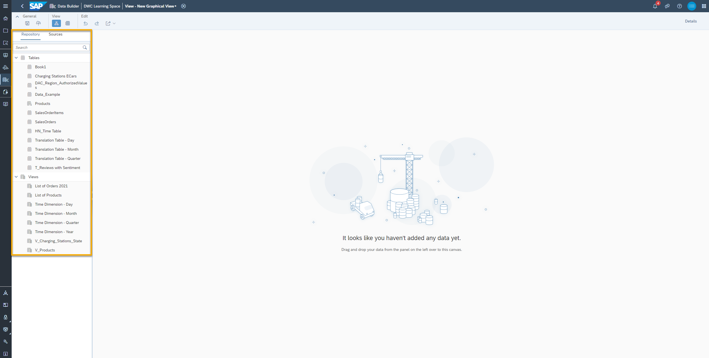
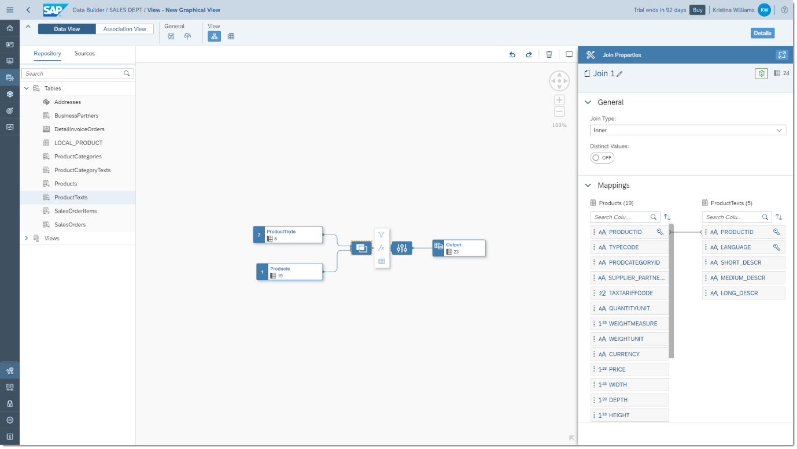
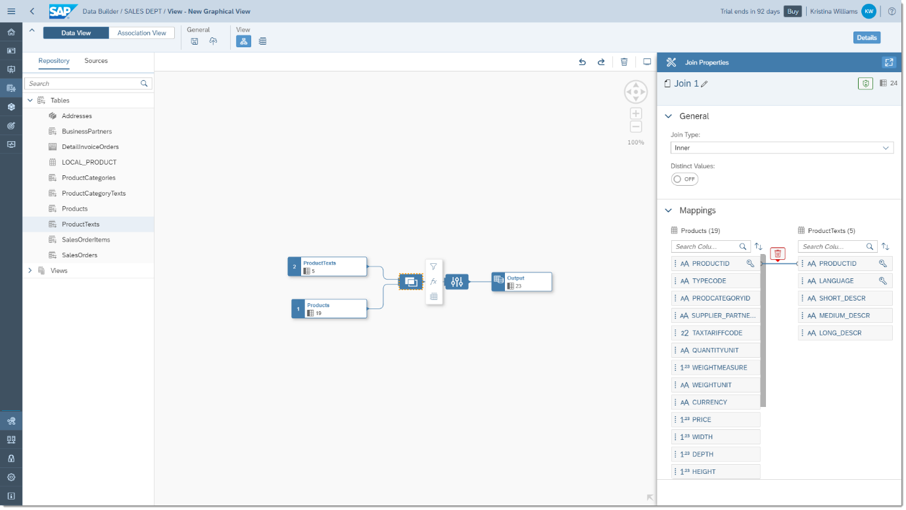
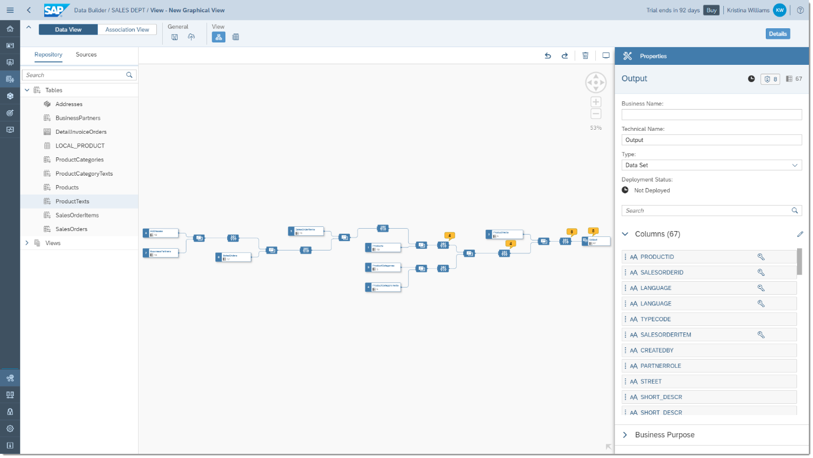
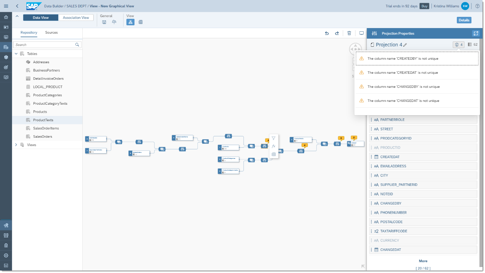
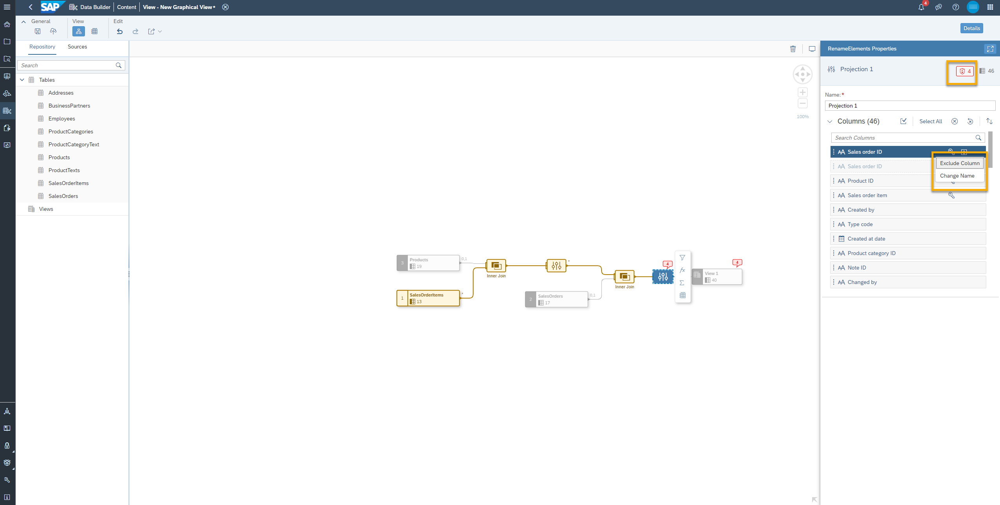
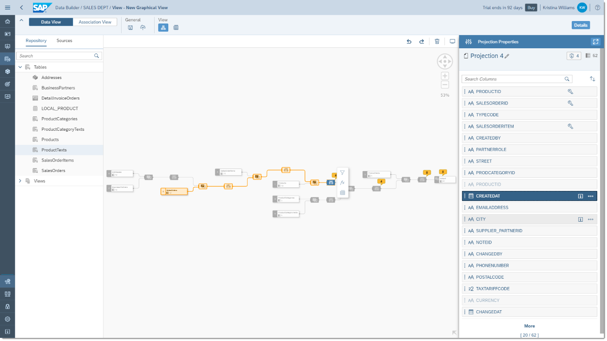
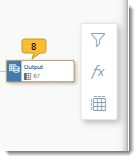
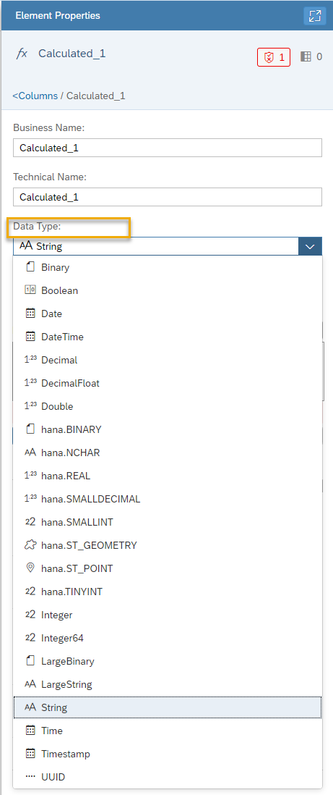

# Model Data with a Graphical View 
<!-- description --> Get started with graphical views using the Data Builder in SAP Data Warehouse Cloud, which helps you to create and visualize the data model.

## Prerequisites
 - You have your SAP Data Warehouse Cloud account or a [trial account](https://www.sap.com/products/data-warehouse-cloud/trial.html)
 - You have imported your dataset into your Space.

## You will learn
- Create a new graphical view in your space
- Add data to your new view
- Create a join or union
- Transform your data
- Preview and deploy

## Intro
In the **Data Builder** of SAP Data Warehouse Cloud, you will learn how to create a graphical view to query sources in an intuitive graphical interface. You can drag and drop sources (table or views) to join them as needed. You can also add other operators to remove or create columns and filter or aggregate data.

If you are unsure what data modeling means, or what a joins and unions are, please use our **community blog posts** to get familiar with these concepts:

•	[Data Modeling in SAP Data Warehouse Cloud](https://blogs.sap.com/2021/07/20/data-modeling-in-sap-data-warehouse-cloud/)

•	[Facts, Measures and Dimensions](https://blogs.sap.com/2021/07/22/facts-measures-and-dimensions/)

---

### Create a new view

To start modeling your data using the graphical view in the Data Builder of SAP Data Warehouse Cloud, follow these steps:

1.  Go to the **Data Builder** in the controls menu of left hand side of the SAP Data Warehouse Cloud welcome page and select the Space in which you want to model your data. You need, of course, to have access to this Space in order to create a new view in it.

2.  Then, click on **New Graphical View**.

    <!-- border -->

3.  This is your canvas to start modeling. Use the left side panel to select your data source. You can either use the data already in the **Repository** of this Space or select from the **Sources** connected to this Space.

    <!-- border -->

### Add data to your view

1.	To add data to your new view, select either one table or view, click on it, and drag it to the canvas in the middle of the screen.

2.	Once you drop it on the canvas, this will create automatically an output node. This node is linked to the table or view you dragged to the canvas.

    <!-- border -->

3.	You can now drag and drop other tables or views on top of the one that is already in the canvas. As you drag the first table or view, you will see a pop-up listing **Union and Join**.

    <!-- border -->
> This is your opportunity to choose to make a union of these tables, which would mean an output with the complete contents of both tables and views. If you don't specifically choose a Union, all tables and views will be joined by default.

4.	Once you have your first join, notice that the canvas rearranges itself to show a Join node and a Projection node.

5.	Click on the Join node to see, on the right sidebar, the details of this join, including which columns are mapped together. This is where you can either change the type of join or change the mappings between the two tables.

    <!-- border -->

6.	In case you accidentally drag a table or view that you do not want to be joined or united in to another particular view or table in your view, you can delete an existing mapping. Just click on the line between the two columns and then click on the **trash** icon in red.

    <!-- border -->

7.	After you add all of your data sources and determine the ways in which these tables or views are connected (or joined), you might notice some yellow or red alerts on top of some of the projection nodes.

    <!-- border -->

8.	Click on one of the projection nodes with a yellow or red alert, then click on the shield icon to see what the issue is.

    <!-- border -->

9.	To solve issue of same names, you can either rename or exclude a duplicate column. If you are sure that the columns have the same information, you should exclude one of them. To exclude a column, just click on the three dots menu on column name, then click on **Exclude Column**.

10.	If, however, the column contents are similar, but not the same, you can rename the column to make sure the information is present on your output but does not create issues with duplication. To rename a column, click on the Projection node, then click on the column you want to rename. This will highlight in the canvas from which table or view this table is coming from.

    <!-- border -->

11.	Make sure to select the right column from the right table and click on the three dots menu.

    <!-- border -->

12.	This time select **Change Name** to rename the Business and or technical name to resolve the issue.

    <!-- border -->

### Transform your data

1.	To make sure your data output includes only the right data, drill down into your data by adding filters to your join, projection, or output nodes. Just click on the node you want to filter, then click on the **Filter** icon right next to the node.

    <!-- border -->

2.	Now you will see the Filter Properties on the right sidebar. You can filter based on columns or type in your expressions as needed. All your changes here are automatically saved, so when you are done, just go to the next step.

    <!-- border -->

3.	Another transformation you can do with SAP Data Warehouse Cloud is to create a new calculated column and add it to your output. To start, just click on the `fx` icon next to the output, a projection, or a join node.

    <!-- border -->

4.	Then, on the right sidebar, you can select an existing column to add a calculation to and click on the pencil icon next to the column. Alternatively, you can click on the plus icon to add a new calculated column.

    <!-- border -->

5.  You can choose between several different **Data Type** options for a calculated column.

    <!-- border -->

### Deploy your view

When you are done with your data modeling and transformation, you still need to make sure to either save, or save and deploy your data model. You should choose Save if you are not yet done with your modeling and still will make changes to it before using the data model in a data story.

But you can directly click on the **Deploy** icon to deploy your data model, which also saves it on your Space's Repository. If you haven't yet added a business and technical name to this data model, you will be asked to do so when clicking either the Save or Deploy icons. Your data model will be available for use in the Business Builder, or in any Business Intelligence visualization tool, like SAP Analytics Cloud.

  

> **Well done!**
>
> You have completed the first tutorial of this group! Now you know how to model data with a graphical view in SAP Data Warehouse Cloud.

> Learn in the next tutorial how to preview, filter, change the joins and obtain the SQL statements for your graphical data view in SAP Data Warehouse Cloud.

### Test yourself

---
