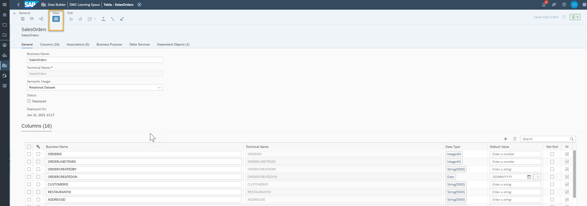
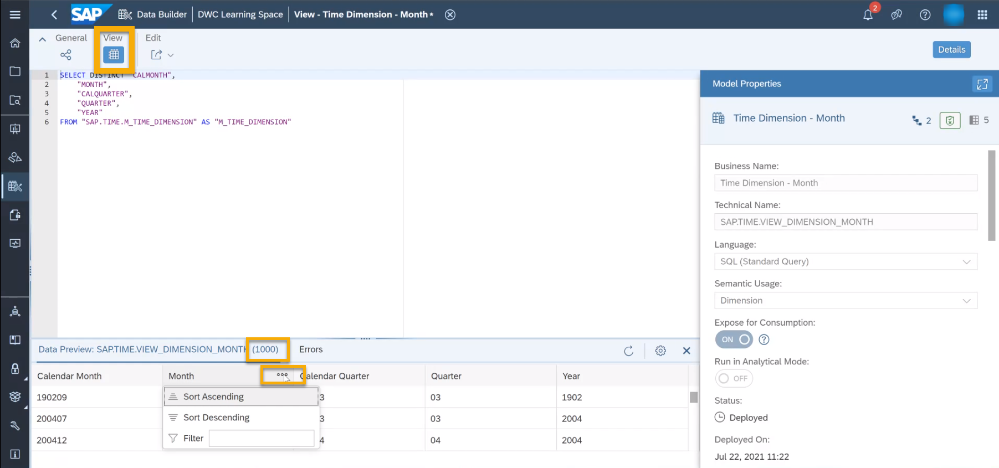
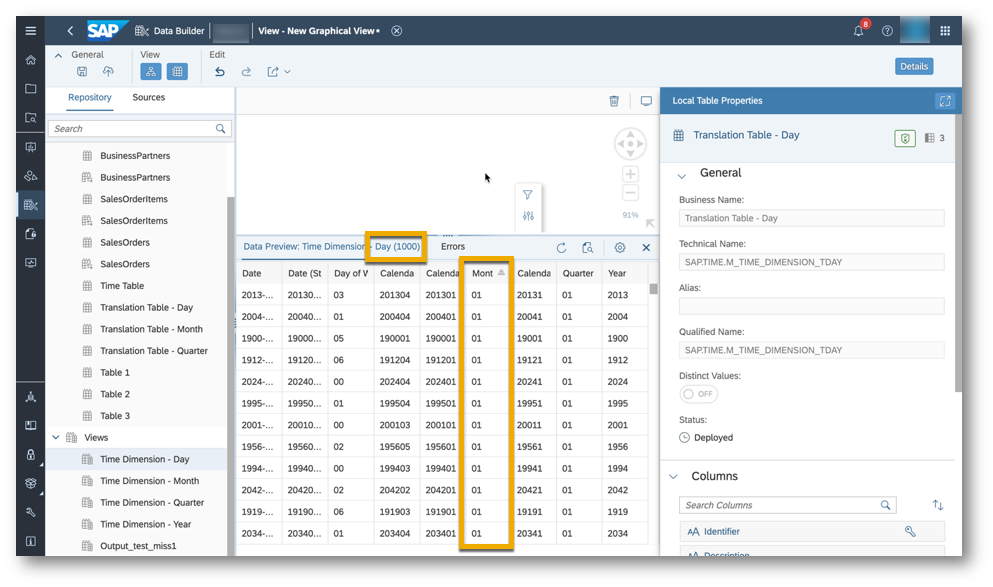
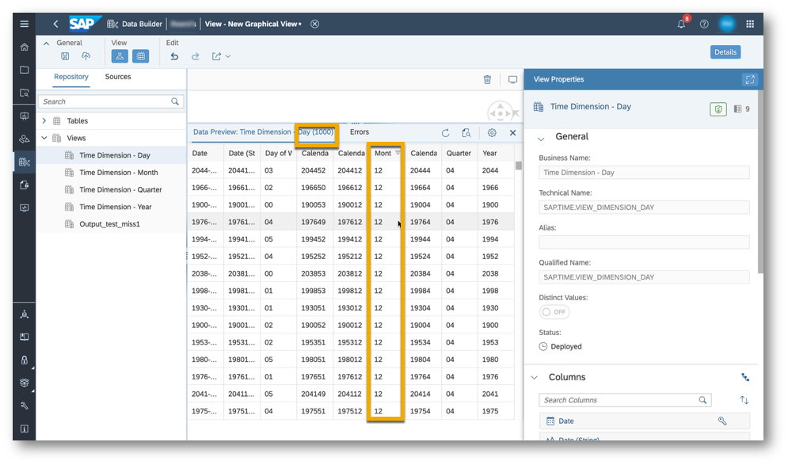
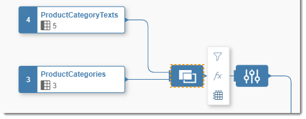
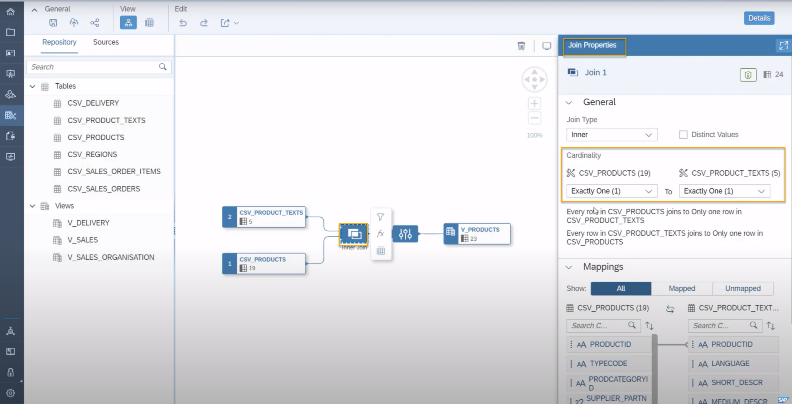
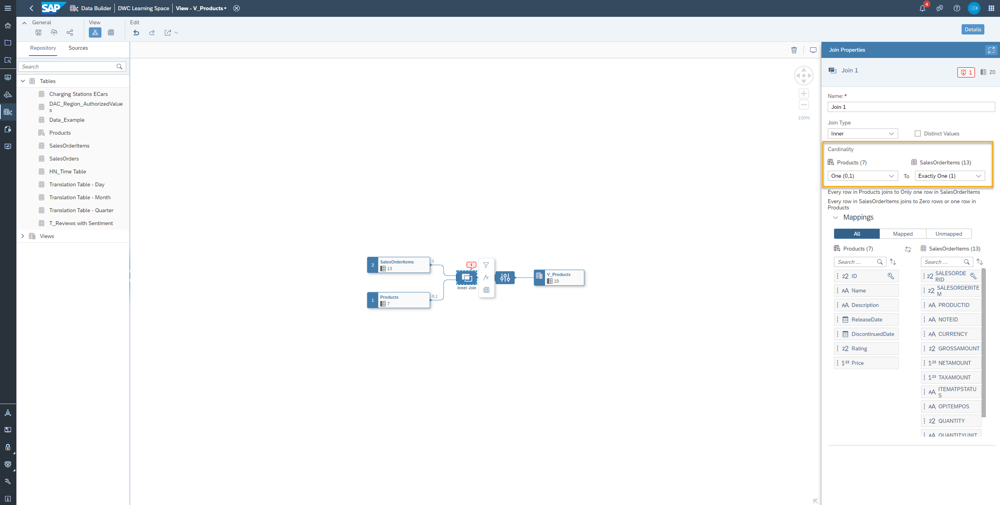
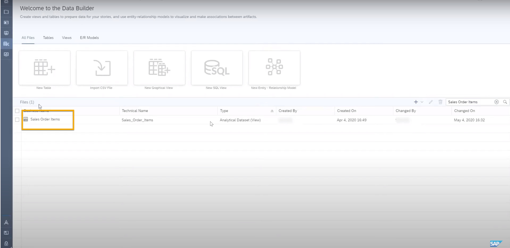
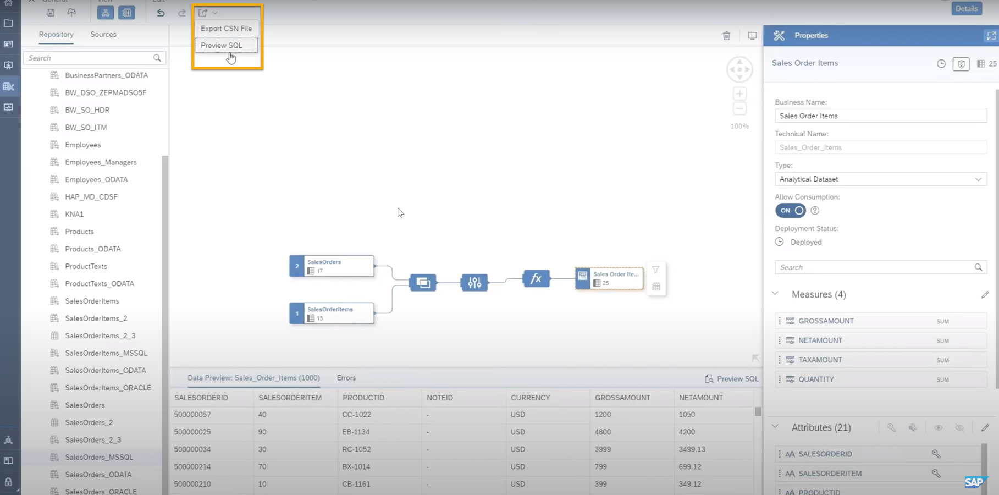

---View
parser: v2
auto_validation: true
time: 10
tags: [ tutorial>beginner, software-product>sap-data-warehouse-cloud]
primary_tag: software-product>sap-data-warehouse-cloud
---

# Preview and Transform Your Data in a Graphical View
<!-- description --> Preview data in SAP Datasphere and further add join cardinalities and convert a graphical view to SQL statements.

## You will learn
- How to preview the data in Data Builder 
- How to sort and filter data
- About the different types of join cardinalities
- How to convert your graphical view to SQL statements

## Intro
The Data Builder in SAP Datasphere comes with easy and effective data preview options to help you analyzing data. Join cardinalities and one click SQL statements from a graphical view are the additional accessories to model your data effortlessly.

---

### Access the Data Preview panel

1.	Go to the **Data Builder** in SAP Datasphere and select your space to see your tables and views listed. Click on the desired table or view for the data preview.

2.	Click on the view icon to preview the data. You can click on this icon to show or hide the data preview.

    <!-- border -->

What you will see first are the first thousand rows in this dataset. But you can sort and filter to view different slices of the data.
This allows you to find specific data easily and increases the usability of the data preview.

### Sort the Data Preview

1.	To sort the data in your data preview, you can choose to sort specific columns in a specific order. For example, you can choose to sort one of the columns, called Month, in ascending order. Hover your mouse over the column you wish to sort, then click on the three dots menu, and then selecting **Sort Ascending**.

    <!-- border -->

    You will now see the values and an arrow mark next to Month column showing a Ascending order symbol.

    <!-- border -->

2.	You can follow the same steps to sort another column in descending order by choosing the **Sort Descending** option from the three dots menu. You will see the last 1000 values displayed.

    <!-- border -->

3.	You can also **filter** data by clicking on the three dots menu of a particular column and then typing a filter value in the filter box based on the column type.

### Preview the output of an existing graphical view

1.	Finally, you can see a preview of the data within a graphical view by clicking on the Preview Data button next to your output node. You can also click on it on the top menu, next to the save and deploy icons.

    <!-- border -->

2.	But you can also preview just one table or one join. To do that, just click on the **Preview Data** icon next to the table or node you want to preview.

    <!-- border -->

3.	You will see the preview on the center lower part of the screen. Notice that you can confirm which preview you are looking at by checking the title of the preview **Data Preview: Output**.

    <!-- border -->

4.	Now you have previewed your data and explored it further by sorting and filtering as required.

### Understand join cardinalities

The cardinality between two or more tables shows how the join relationships are between rows of one table and rows in a second table, that is, it describes how many entries of one table correspond to the entries of another table. **Join cardinalities** enables optimized database execution plans and performance. Please see here the types of join cardinalities that SAP Datasphere supports in the graphical view builder.

-	Many to Many
-	Many to One
-	Many to Exactly One
-	One to Many
-	Exactly One to Many
-	One to One
-	Exactly One to One
-	One to Exactly One
-	Exactly One to Exactly One

In the screenshot below you can see an example of Exact One to Exact One relationship in the join properties of the data model.

  <!-- border -->

You can change the join cardinality in the join properties of the data model. Click on the join node in the modeling canvas and then select the supported join cardinality in the join properties canvas based on the tables you are using for the model.

  <!-- border -->

### Convert a graphical view to SQL statements

You can now compute and display SQL statements from the graphical view builder. You can benefit from debugging and validation with the converted SQL statements while building your data models. The resulting SQL statements can also be used as a basis for creating other SQL views in the Data Builder.

The  following steps will guide you through the process of converting a graphical view to SQL statements.

1.	Go to **Data Builder** in SAP Datasphere.

2.	Open any of your available views, In the below screenshot, you can see a `Sales Order Items` view.

    <!-- border -->

3.	Click on the export icon to select **Preview SQL**.

    <!-- border -->

4.	Copy the SQL statements from the dialog and use it to debug, validate or even creating a new SQL view.

Currently, it is not possible to get a graphical view on the basis of SQL statements.

> **Well done!**
>
> You have completed the 2nd tutorial of this group! Now you know how to preview data and make use of different tools in the Data Builder.

> Learn in the next tutorial how to add new columns in the Data Builder.

### Test yourself

---
