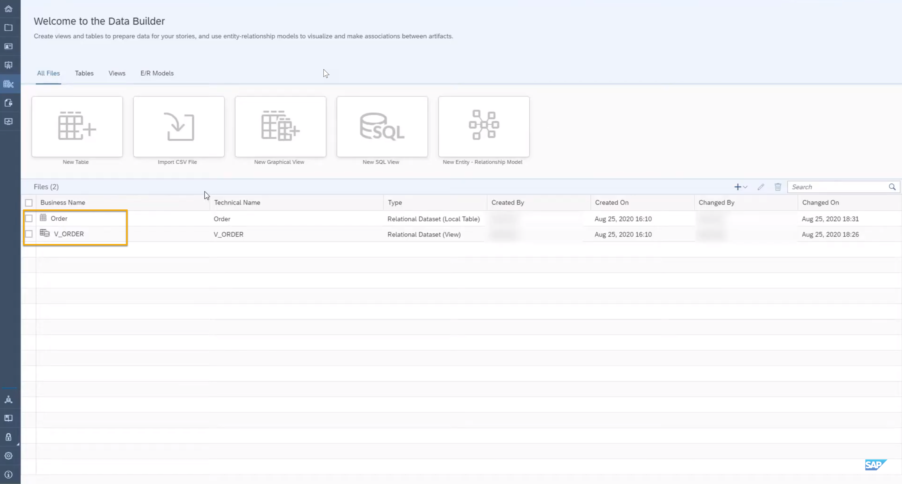
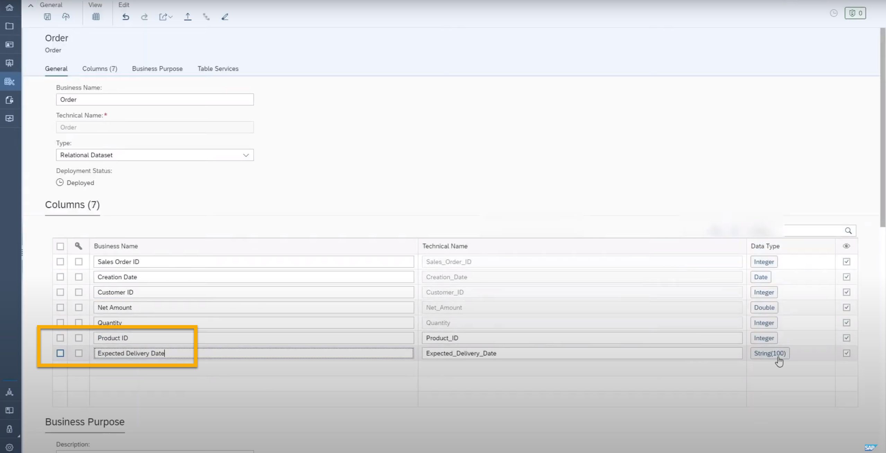
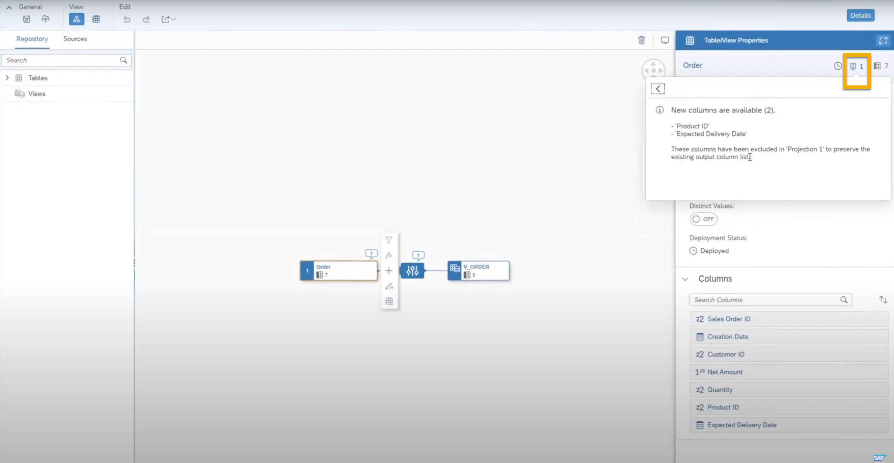
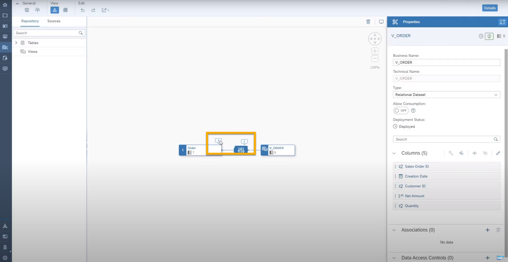

---DWC
parser: v2
auto_validation: true
time: 10
tags: [ tutorial>beginner, software-product>sap-data-warehouse-cloud]
primary_tag: software-product>sap-data-warehouse-cloud
---

# Create New Columns in a Graphical View
<!-- description --> Add new columns to a table or existing graphical view in SAP Datasphere and adapt them for the output structure.

## Prerequisites
- Have at least one graphical view created and deployed in SAP Datasphere -- see [Model Data with a Graphical View](data-warehouse-cloud-graphical1-model).

## You will learn
- Create new columns in a table or existing view
- Understand the impact of making changes to data models
- Restore new columns and deploy the changes

## Intro
**The Data Builder** in SAP Datasphere makes it simple to make changes to your data while you model it. In this tutorial, you will see what happens to dependent views when new columns are added to a table or view in SAP Datasphere. 

---

### Create new columns

The steps below will guide you through adding new columns and managing changes in data models with SAP Datasphere.

> In this tutorial, you will see an example related to orders and sales in the Data Builder. But you can follow the steps with any kind of data you might have on your system.

As an example, imagine you have a table called `ORDER`. This table has several fields such as `SalesOrderID`, `CreationDate`, and so on. This table was also used to build a dependent view called `V_ORDER`.

<!-- border -->

1.	Modify the `ORDER` table by adding two new fields, for example `Product_ID` and the `Expected_Delivery_Date`.

2.	To accomplish this, go to the Data Builder and click on the table `ORDER`.

3.	You will see a list of columns with their business name. To add a new column, click on the plus icon. Enter the business and technical name for the column. As an example, add `Product_ID` and the `Expected_Delivery_Date`.

    <!-- border -->

4.	The last step is to deploy the table by clicking on the deploy icon.

Now your table is changed. It is time to open the dependent view and see what has changed.

### Understand the impact of making changes to data models

1.	First, open the dependent view in the Data Builder. By default, you will see a notification pop up window about the changes in the source table. When you close the pop-up, you will see the notification bubbles on the screen in the modeling canvas of the dependent view.

    <!-- border -->

2.	To review the changes, select the source table in the canvas and click on notifications icon of the table/view properties sidebar. In this example, you can see that two new columns have been added and are available but are not shown in the output node.

    <!-- border -->
> The newly created columns are not shown in the output node and this will always happen by default. The system is automatically adding a new projection node that hides these two new columns and preserves the existing output column list you had before creating the new columns.

3.	To enable the two newly created columns, click on the projection node and then click on the notification icon. You will see a message that you can keep everything as is without the newly created columns or enable these new columns by restoring them.

### Restore new columns and deploy the changes

If you need to restore the new columns you previously added, follow these steps:

1.	Click on the projection node.

2.	Then click on one of the newly created column name and on the three dots. This opens a contextual menu.

3.	Click on **Restore Column** and the column will be added to the output node.

4.	Save the view to accept the changes and the notifications will vanish.

5.	Repeat the same steps for the other column.

  <!-- border -->

> Note that if you want to restore all hidden columns at once, simply delete the system generated projection node. You can now deploy the table as usual.

> You can alter the primary key of a table in data builder of SAP Datasphere, even if the table already contains data and even if you have added a new column. The system validates new primary keys and checks tables for null values and uniqueness of the record sets. Also, the system supports compound and or multiple primary keys to adapt to the table data and modeling requirements. At the same time, it prevents you to enter data sets into an already existing data set if it is not unique.

  <!-- border -->

> **Well done!**
>
> You have completed the 3rd tutorial of this group! Now you know how to add new columns.
> Learn in the next tutorial how to understand the notification bubbles.

### Test yourself

---
