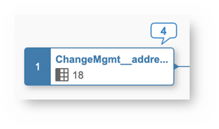
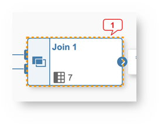

# Use Notification Bubbles in SAP Data Warehouse Cloud
<!-- description --> Understand notification bubbles in SAP Data Warehouse Cloud, whose purpose is to signal changes that happen in the data models as well as their severity.

## Prerequisites
- Have at least one graphical view created and deployed in SAP Data Warehouse Cloud -- see [Model Data with a Graphical View](data-warehouse-cloud-graphical1-model).

## You will learn
- How to understand different notification bubbles
- How to track changes with information bubbles
- How to be aware of issues with warning bubbles
- How can you make use of error bubbles

## Intro
The notification bubbles in SAP Data Warehouse cloud are not just notifications! A click on a bubble will give you additional information and suggest actions to resolve any underlying issues.

---

### Understand the Notification Bubbles

<iframe width="560" height="315" src="https://www.youtube.com/embed/EN6Cg1Z9wyE" title="YouTube video player" frameborder="0" allow="accelerometer; autoplay; clipboard-write; encrypted-media; gyroscope; picture-in-picture" allowfullscreen></iframe>

In this video, you will see an example of data model being broken on purpose, so that you can see all types of notification bubbles in SAP Data Warehouse Cloud.

### Get to know the information bubbles

You will see the blue information bubbles in case of changes or updates to your data models.

For example, if an underlying source table used in your view has been changed, you will see a notification bubble. With these bubbles, it is easy for you to see when any changes have been made.

  <!-- border -->

### Get to know the warning bubbles

You will see the orange warning bubbles when changes or actions may cause issues.
For example, if you save a data flow without the final output table or with a branch that is not connected to any outputs, this would prompt a warning. These bubbles say: This may not work – proceed with caution!

  <!-- border -->

### Get to know the error bubbles

Finally, red error bubbles highlight errors and situations that need your intervention.

Some of the examples create an impossible join condition or having a syntax error in a formula.

<!-- border -->

> Please note from release `2021.10` on, a new version history is created each time a model is successfully deployed. Those versions can be retrieved through a specific endpoint.

<!-- border -->

> **Well done!**
>
> You have completed the 4th tutorial of this group/mission! Now you know how to make use of different notification bubbles.

> Learn in the next tutorial how to generate time tables and dimensions.

### Test yourself

---
